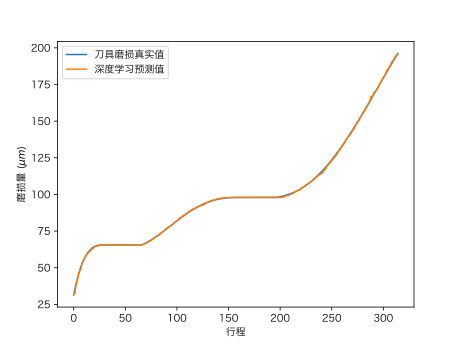
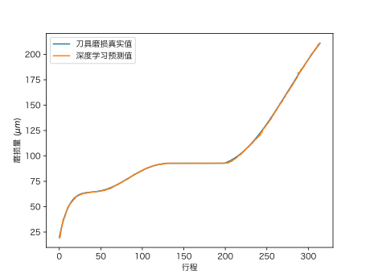

# Digital Twins by Generative Adversarial Nets

This project is aimed to simulate tool wear in digital way. We want to simulate signal in machining process so that we can do those in the following:

+ simulate signal in machining process
+ reinforcement learning in small data
+ visualization on deep learning model
+ transfer learning at very few data

We use DCGAN model with tool wear label to achieve that. GAN training is fast and the validity of simulated result will be tested later.

## attention

Since sensor signal is totally different from vision, many adjustments for 1D signal and our working condition is done. Be careful if you want to reuse this code to your environment.

# Demonstrate

You can visit our homepage to know this project better.

Address : [https://kidozh.com/projects/digital_twins_by_GAN/](https://kidozh.com/projects/digital_twins_by_GAN/)

# Result 

## For GAN

you can find result in directory `res`. It includes trained model and signal pictures generated for different tool wear stage. The signal is displayed in 7 dimension corresponding to sub-directory.

Since it's not as intuitive as image, it's hard for human to identify but maybe easy for ResNet model.

## For newly-designed ResNet

MSE is 0.630 while MAE is 0.417.

# Contact

Please feel free to contact with me in mail and issue way about academic consult. Also fork is welcomed. Other things involved with cooperation with certain region may be restricted under NPU's related regulation.

[Here](https://kidozh.com/keras_detect_tool_wear/epidemic_prevention_notice.html) is a demonstration of restricted area or people.

# LICENSE

MIT LICENSE
